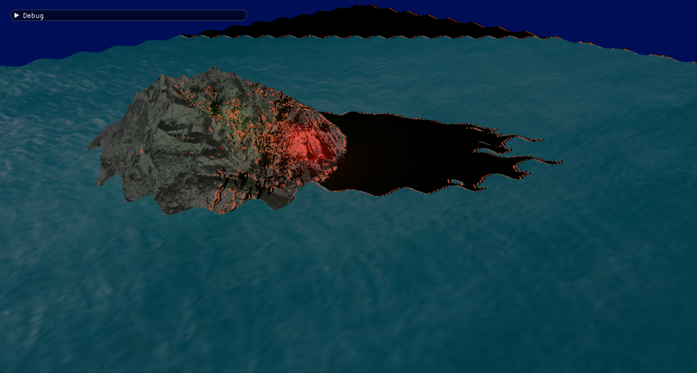
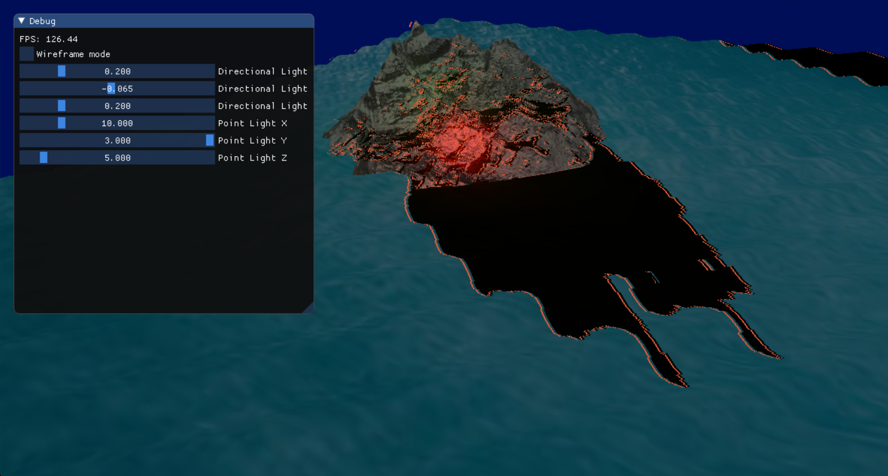
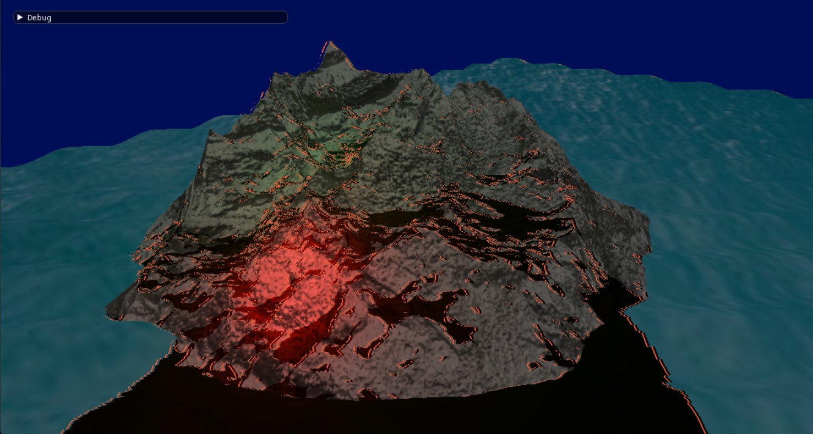
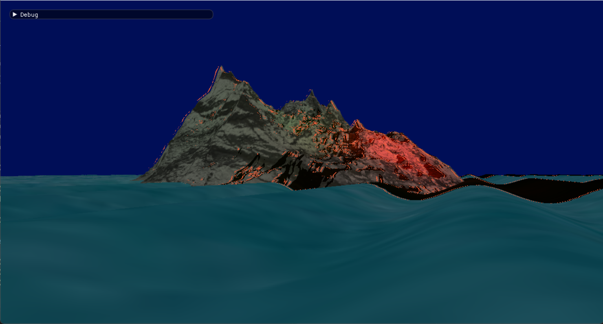

# DirectX 11 Real-Time Rendering Pipeline

A custom real-time rendering pipeline built in C++ using DirectX 11 and HLSL. The project explores low-level graphics programming through manual GPU resource management, shader-based lighting, shadow mapping, animated water rendering, and post-processing effects.

The focus was to understand how rendering systems are structured without relying on a commercial game engine.

---

## Features

- Custom DirectX 11 rendering pipeline
- Explicit GPU resource management
- HLSL vertex and pixel shaders
- Dynamic directional and point lighting
- Shadow mapping
- Multi-pass rendering
- Animated water using vertex displacement
- Screen-space post-processing effects
- Runtime debug controls for lighting and rendering parameters

---

## Technologies

- C++
- DirectX 11
- HLSL
- Real-Time Rendering
- Shader Programming
- Graphics Programming

---

## Technical Overview

The renderer follows a forward rendering approach, where scene geometry is processed through custom HLSL shaders and rendered through multiple passes.

Intermediate render targets are used for post-processing effects, allowing frame data to be reused and recombined before final output. The project also includes runtime controls for testing lighting, shadow behaviour, and rendering parameters during execution.

---

## Gallery

### Terrain Rendering

### Runtime Debug Controls

### Terrain Lighting

### Vertex-Displaced Water

---

## Status

Completed as part of MSc graphics programming coursework.

Potential future improvements include:

- Deferred rendering
- Physically based rendering
- Cascaded shadow mapping
- Screen-space ambient occlusion
- GPU profiling and performance tuning

---

## Portfolio

Portfolio project page:

https://miguelfiuzagomes.github.io/portfolio/
